# 📘 Minda - Personal Journal App

**Minda** adalah aplikasi jurnal pribadi berbasis Android yang modern, *offline-first*, dan mengutamakan privasi. Dibangun sepenuhnya menggunakan **Kotlin** dan **Jetpack Compose**, aplikasi ini memungkinkan pengguna mencatat momen harian, melacak suasana hati (*mood*), dan melihat kilas balik aktivitas melalui kalender dan statistik.

> **Project ID:** `id.antasari.p6minda_230104040129`  
> **Min SDK:** API 24 (Android 7.0)  
> **Target SDK:** API 34

---

## ✨ Fitur Utama

* **🔒 Privacy First:** Semua data tersimpan secara lokal (Offline) di perangkat menggunakan **Room Database**. Tidak ada data yang dikirim ke cloud.
* **👋 Personalized Onboarding:** Alur pengenalan aplikasi yang ramah, menyimpan nama pengguna menggunakan **DataStore Preferences**.
* **📝 CRUD Jurnal:** Membuat, Membaca, Mengubah, dan Menghapus catatan harian dengan mudah.
* **📅 Calendar View:** Tampilan kalender interaktif untuk menavigasi entri berdasarkan tanggal.
* **📊 Insights & Mood Tracker:** Visualisasi statistik jurnal dan grafik donat untuk memantau pola suasana hati (*mood*).
* **🎨 Modern UI:** Antarmuka Material Design 3 yang bersih dengan tema warna kustom (Biru) dan animasi navigasi yang halus.

---

## 📱 Screenshots

Berikut adalah tampilan antarmuka aplikasi Minda:

### 1. Onboarding Flow
Pengalaman pertama pengguna saat membuka aplikasi.

| Welcome | Ask Name | Hello | Start |
|:---:|:---:|:---:|:---:|
| 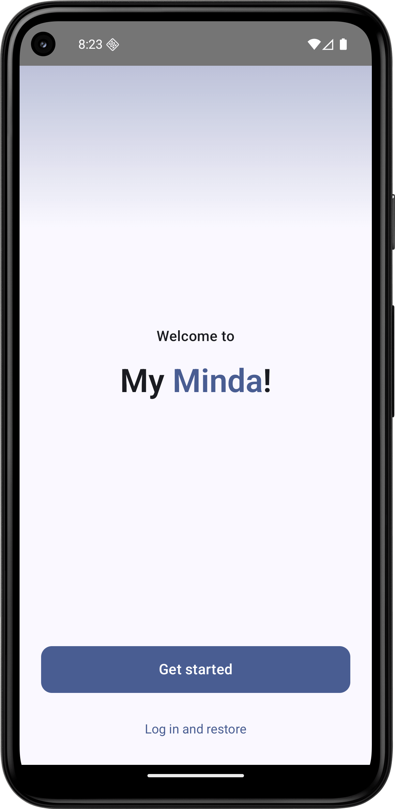 | 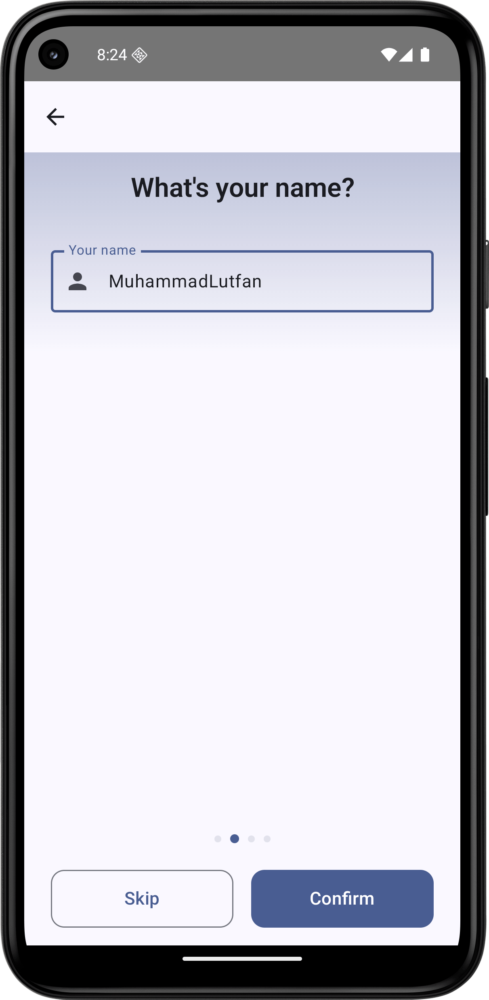 | 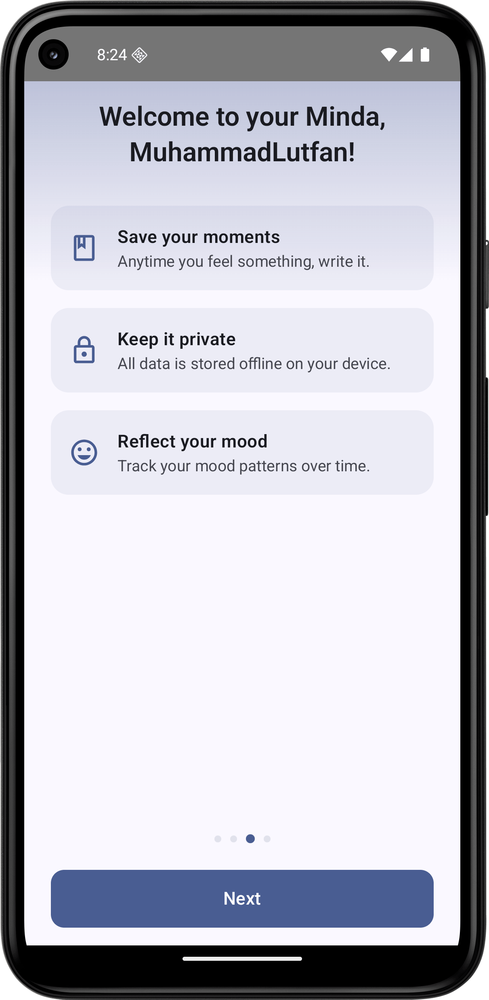 | 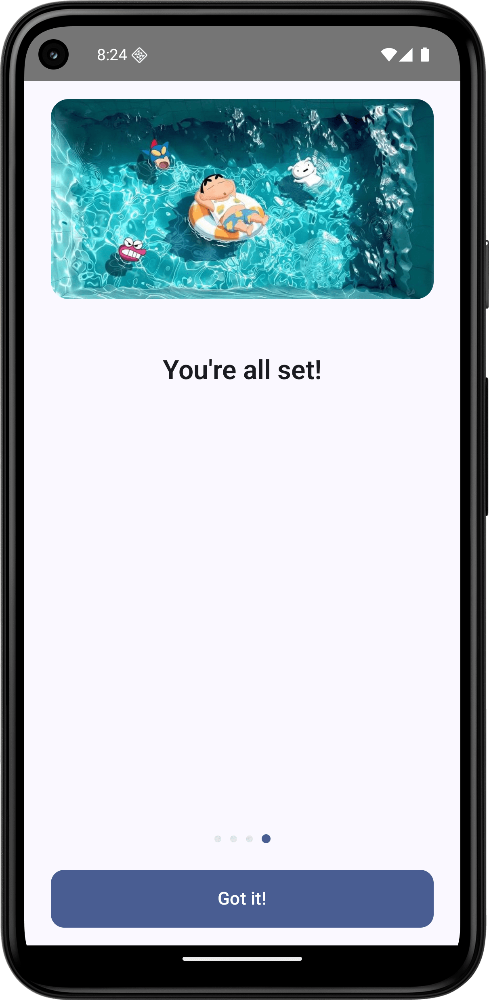 |

### 2. Fitur Utama (Home & Entry)
Halaman utama dan proses pembuatan catatan.

| Home Screen | New Entry (FAB) | Edit Entry | Note Detail |
|:---:|:---:|:---:|:---:|
| 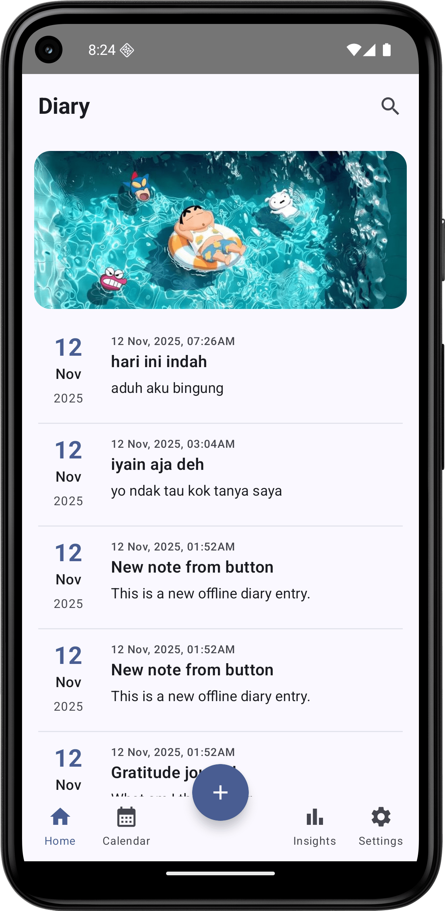 | 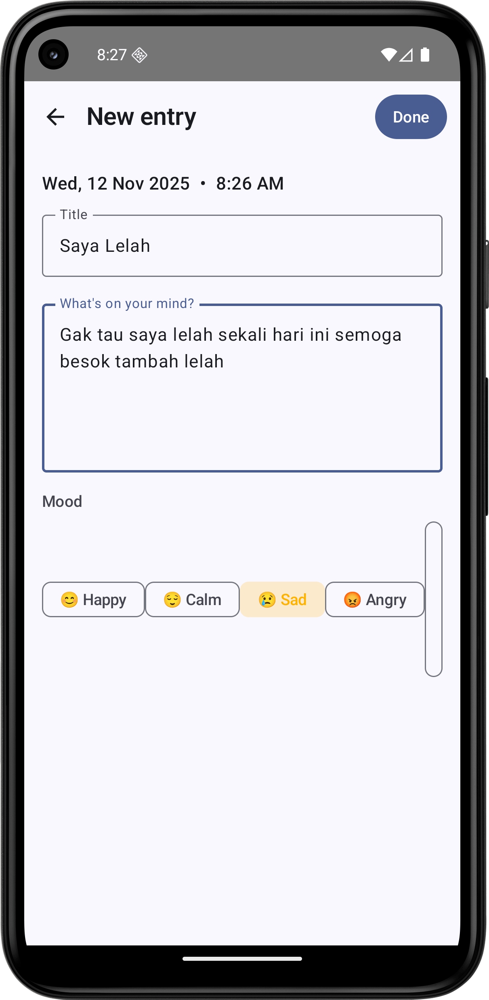 | 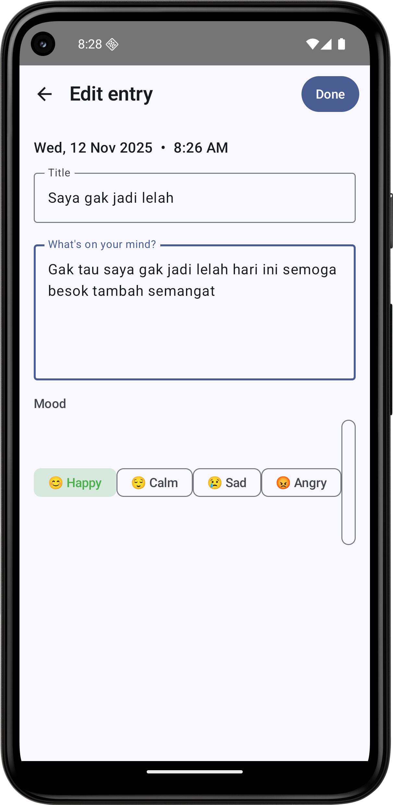 | 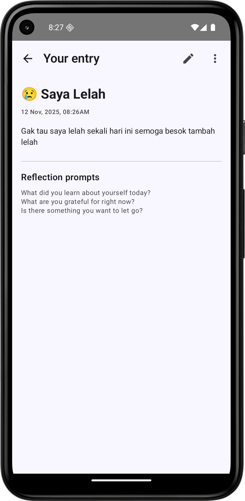 |

### 3. Fitur Tambahan (Tabs)
Navigasi fitur pendukung melalui Bottom Navigation Bar.

| Calendar View | Insights / Stats | Settings |
|:---:|:---:|:---:|
| 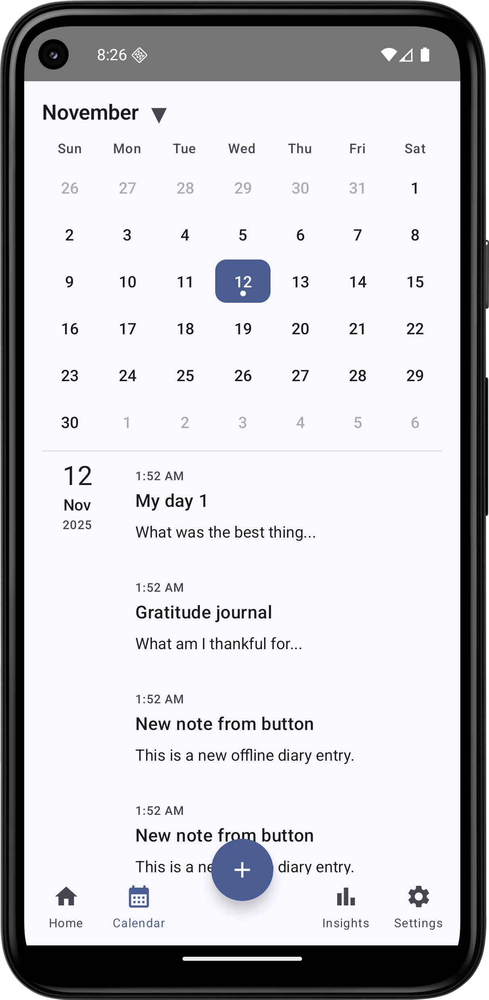 | 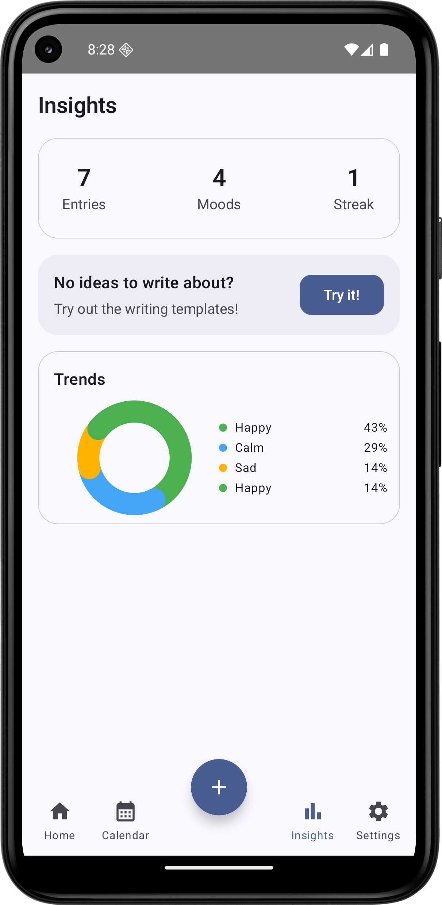 | 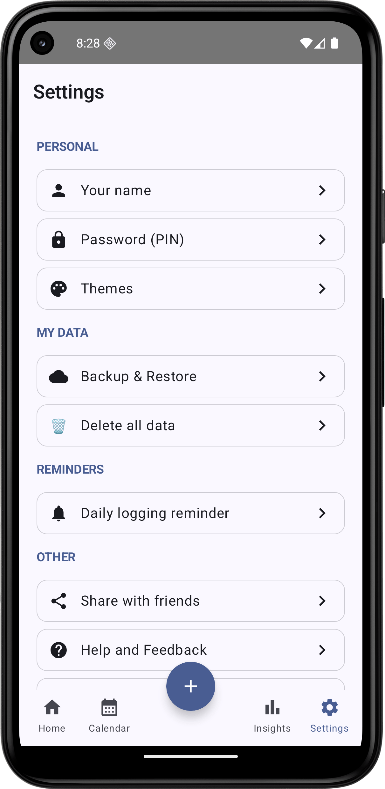 |


## 🛠️ Teknologi & Library

Aplikasi ini dibangun menggunakan standar pengembangan Android modern:

* **Bahasa:** [Kotlin](https://kotlinlang.org/)
* **UI Toolkit:** [Jetpack Compose](https://developer.android.com/jetpack/compose) (Material 3)
* **Navigasi:** [Navigation Compose](https://developer.android.com/guide/navigation/navigation-compose)
* **Database Lokal:** [Room Persistence Library](https://developer.android.com/training/data-storage/room) (SQLite)
* **Penyimpanan Key-Value:** [DataStore Preferences](https://developer.android.com/topic/libraries/architecture/datastore)
* **Asynchronous:** [Coroutines](https://kotlinlang.org/docs/coroutines-overview.html) & [Flow](https://kotlin.github.io/kotlinx.coroutines/kotlinx-coroutines-core/kotlinx.coroutines.flow/-flow/)
* **Build System:** Gradle (Kotlin DSL) dengan [KSP](https://github.com/google/ksp) (Kotlin Symbol Processing).
* **Date handling:** Java Time API (dengan Desugaring support).

---

## 📂 Struktur Proyek

Arsitektur proyek memisahkan antarmuka (UI) dengan logika data (Data Layer).

```text
id.antasari.p6minda_230104040129
├── data/                  # Layer Data (Room & DataStore)
│   ├── DiaryEntry.kt      # Entity (Tabel)
│   ├── DiaryDao.kt        # Data Access Object
│   ├── MindaDatabase.kt   # Konfigurasi Database Room
│   ├── DiaryRepository.kt # Single Source of Truth untuk data Jurnal
│   └── UserPrefsRepo.kt   # Pengelola DataStore (Nama & Onboarding)
├── ui/                    # Layer UI (Compose Screens)
│   ├── calendar/          # Komponen Kalender & ViewModel
│   ├── navigation/        # Konfigurasi NavHost & Routes
│   ├── BottomNav.kt       # Komponen Bottom Bar Kustom
│   ├── HomeScreen.kt      # Layar Utama
│   ├── NoteDetailScreen.kt# Layar Detail
│   ├── NewEntryScreen.kt  # Layar Tambah Data
│   ├── EditEntryScreen.kt # Layar Edit Data
│   ├── ExtraScreens.kt    # Layar Insights & Settings
│   └── Onboarding...kt    # Layar-layar Onboarding
└── MainActivity.kt        # Entry Point & Setup Navigasi
